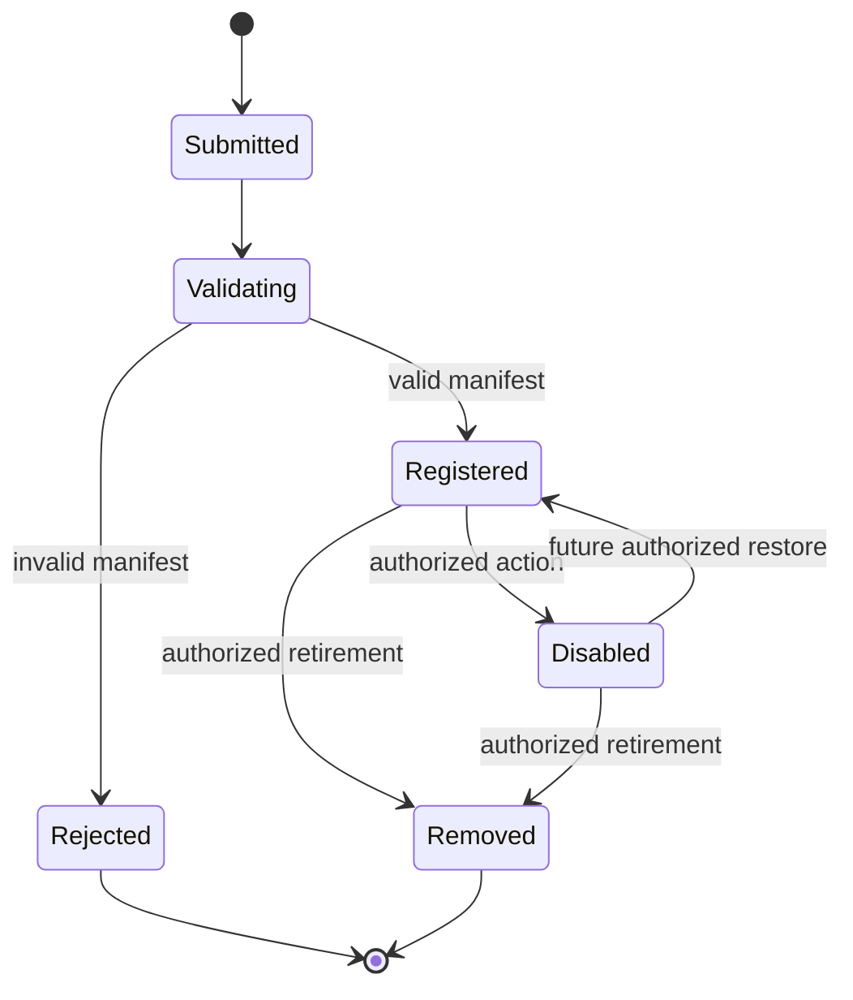

# AI Registry Design

## Purpose

The AI Registry is the authoritative inventory of AI agents. Registration is required
before an AI may become operational. The Registry does not execute AI workloads and
does not grant itself authority.

## Gate 0 Scope

- `AIManifest` extends the standard component manifest.
- Manifest validation covers identity, semantic version, purpose, classification,
  limitations, Brain assignments, dependencies, permissions, endpoints, configuration,
  and documentation.
- Registration states are `submitted`, `validating`, `rejected`, `registered`,
  `disabled`, and `removed`.
- Registered components begin `offline`; registration never starts an AI.
- Queries may filter by status, capability, and dependency.
- Health updates use the standard health contract.

## Registration Lifecycle

## Security Rules

- Registration does not imply permission to execute.
- Registry persistence and mutation authorization belong to Gate 1 Kernel services.
- Disable, restore, and remove actions must become append-only audited actions.
- AI manifests may request permissions; only the Kernel may grant them.
- An AI cannot register itself as Owner, Kernel, or infrastructure authority.
- Duplicate IDs and self-dependencies are rejected.

## Implementation Location

- Contracts and validator: `src/platform/registry/ai-registry.ts`
- Standard manifest: `src/platform/manifests/`
- Tests: `src/platform/registry/ai-registry.test.ts`
