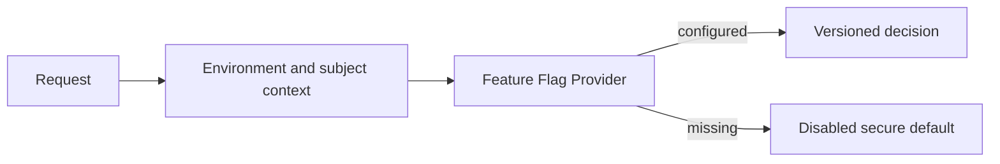

# Feature Flag Design

## Principles

- Major subsystems are configuration controlled.
- Missing and unknown flags fail closed.
- Flags do not bypass authentication, authorization, or Owner authority.
- Secrets are never stored in flag values.
- Flag changes become versioned and audited when persistent configuration is added.

## Gate 0 Flags

`kernel`, `haley`, `scarlett`, `production`, `hope-shield`, `hope-s`, `hope-tech`,
`wallet`, `trading`, `marketplace`, `billing`, `avatar-studio`, and `experimental`.

Only `kernel` is enabled in the example configuration. All business and experimental
capabilities default to disabled.

## Evaluation

Gate 1 should introduce validated configuration loading, environment overlays, Owner-
approved administrative changes, audit history, rollback, and deterministic tests.
