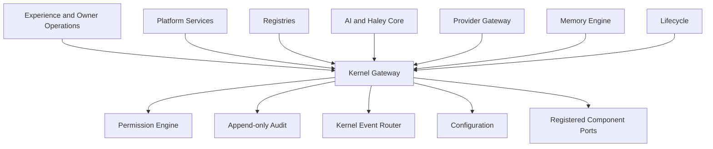

# Kernel-Centered Platform Architecture

## Rule

The System Kernel is XAICore's single architectural center. Every platform operation
enters with a Kernel request context, receives a permission decision, routes through a
registered Kernel component port, and produces Kernel event and audit outcomes.

The Kernel is the sole architectural authority coordinating communication between
platform components. This applies to all present and future AI, services, modules,
providers, infrastructure, plugins, Feature Flags, memory operations, audit and
security services, wallets, trading systems, blockchain components, and extensions.



Shared TypeScript contract imports do not create runtime authority. Runtime calls,
state mutations, provider execution, permission evaluation, event publication, and
lifecycle transitions must cross the Kernel gateway rather than call another platform
implementation directly.

An exception is valid only when the Kernel architecture explicitly authorizes it
through an accepted ADR and a Kernel-managed interface. Local convenience, performance,
or an existing dependency does not authorize a bypass.

## Contract Boundaries

- `KernelRequestContext` supplies request, correlation, environment, and authenticated
  actor context without exposing private Root Authority mechanisms.
- `KernelGateway` is the central operation entry point.
- `KernelReadGateway` is the read-only subset supplied to awareness services such as
  Haley Core.
- `KernelComponentPort` is the only runtime integration surface for platform
  implementations.
- `KernelPermissionEngine`, `KernelAuditWriter`, `KernelEventPublisher`, and
  `KernelConfigurationReader` are Kernel-owned infrastructure ports.
- Denial is the required default whenever authentication, registration, capability, or
  permission evidence is absent.

The initial Gate 1 files are contracts, not a production Kernel implementation.
Identity, persistence, policy enforcement, recovery, and operational adapters remain
in their approved workstreams.

## Privileged Operation Chain

```text
Owner
  -> Kernel
    -> Permission Engine
      -> Authorized Platform Service
        -> Registry or Target Component
```

Haley Core may prepare, analyze, recommend, monitor, report, and request Owner approval
for an operation. It is never an execution step in this authority chain.
