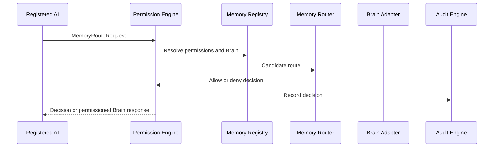

# Memory Engine Design

## Purpose

Memory is a permission-controlled platform resource. It is not owned by an AI agent.
The Memory Engine coordinates discovery, routing, permissions, encryption policy,
version metadata, and retention contracts.

## Gate 0 Scope

- `BrainContract` describes a cognitive domain without storing knowledge.
- `MemoryRegistry` defines Brain registration and permission discovery.
- `MemoryPermissionContract` grants explicit operations to a subject and Brain.
- `MemoryEncryptionContract` references keys; it never contains key material.
- `MemoryVersionContract` defines lineage, checksum, actor, and timestamp metadata.
- `MemoryRouter` returns an explicit allow/deny routing decision with a reason.
- `MemoryEngine` composes registry, routing, and authorization contracts.

## Request Flow

Brain storage, embeddings, retrieval, personal memory, retention jobs, and deletion
workflows are intentionally deferred. Gate 1 designs persistence and constitutional
authorization before any user or AI memory is stored.
