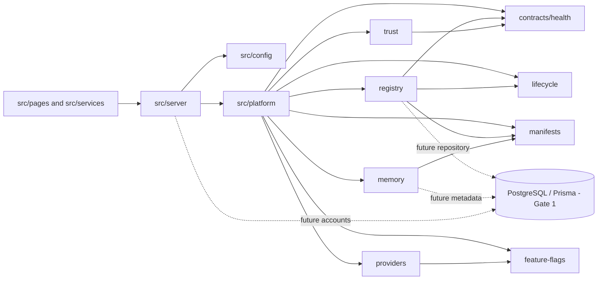

# Module Dependency Diagram

## Dependency Law

- `src/platform` must not depend on UI code or business modules.
- Contract packages may depend only on narrower platform contracts.
- Business modules may depend on platform contracts, never the reverse.
- Provider adapters implement Provider Gateway interfaces outside the core contracts.
- Persistence is introduced through repositories in Gate 1, not directly inside
  domain contracts.
- Circular dependencies are prohibited.
