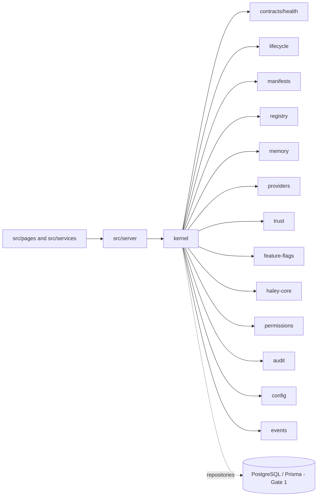

# Module Dependency Diagram

## Dependency Law

- The Kernel is the single runtime integration center.
- Platform components implement Kernel ports and do not invoke peer implementations.
- Shared contract imports may depend only on narrower platform contracts and carry no
  runtime authority.
- Business modules and AI may depend on Kernel contracts; the Kernel never depends on
  UI or business modules.
- Provider adapters, persistence adapters, and external infrastructure remain behind
  Kernel-owned contracts.
- Persistence is introduced through repositories owned by Kernel services, not
  directly inside domain contracts.
- Circular dependencies and runtime peer-to-peer platform calls are prohibited.
