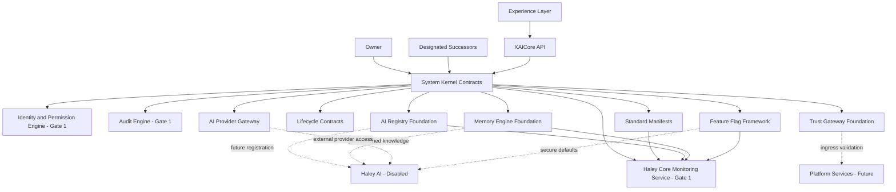

# Platform Architecture

## Gate 0 Architecture

Solid lines represent Gate 0 or Gate 1 platform relationships. Dotted lines represent
disabled future integrations. No AI implementation is active in Gate 0.

## Layer Rules

1. The Experience layer communicates through authenticated APIs.
2. Business and AI modules consume Kernel contracts; they do not own infrastructure.
3. External AI providers are reachable only through the Provider Gateway.
4. Memory requests are routed through permission and registry contracts.
5. External content enters through Trust Gateway contracts where practical.
6. Every component declares a manifest, health contract, dependencies, permissions,
   lifecycle behavior, configuration keys, and documentation.
7. Disabled or unknown feature flags fail closed.
8. Haley Core observes through read-only contracts and cannot execute privileged
   actions or access private Root Authority mechanisms.
9. The Kernel is the single runtime integration center. Platform components expose
   Kernel ports and do not form peer-to-peer runtime dependencies.

See [Kernel-centered platform architecture](kernel-centered-platform.md) for the Gate 1
contract boundary.
