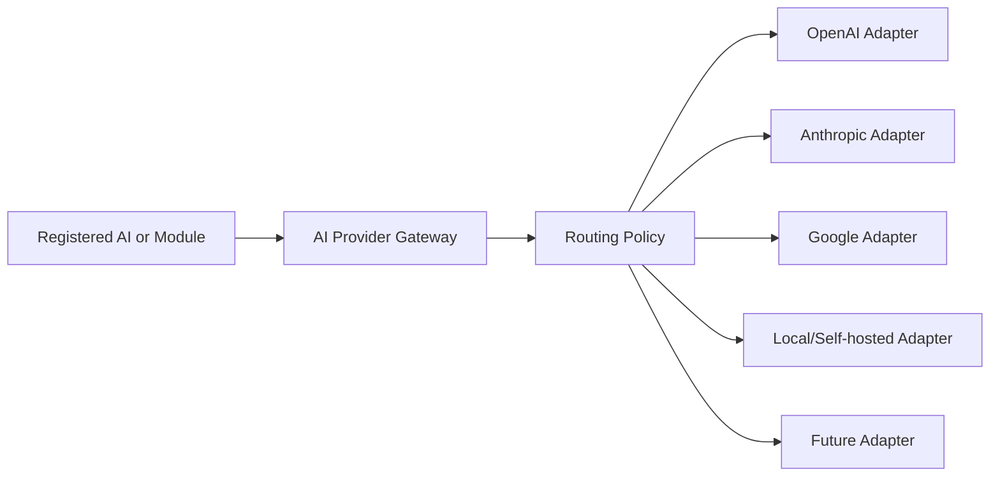

# AI Provider Gateway Design

## Rule

No AI or business module may call an external AI provider directly.

## Contracts

- `AIProviderDescriptor`: provider identity, kind, capabilities, and configuration keys.
- `AIProviderAdapter`: provider-specific execution behind a common contract.
- `AIProviderRoutingPolicy`: selects a configured adapter based on capability and policy.
- `AIProviderGateway`: registers adapters, lists descriptors, and executes requests.
- `AIProviderRequest` and `AIProviderResponse`: provider-neutral request envelopes.

## Security and Operations

- Adapters declare configuration key names, never secret values.
- Provider credentials will be resolved through the future Secret Management Service.
- Every request requires a request ID, capability, timeout, and non-sensitive metadata.
- Gate 1 must add policy enforcement, budgets, retries, circuit breakers, redaction,
  audit events, usage accounting, and content-safety hooks.
- Provider choice is configuration and policy, not business-code branching.

Gate 0 includes no provider adapter and performs no external AI request.
