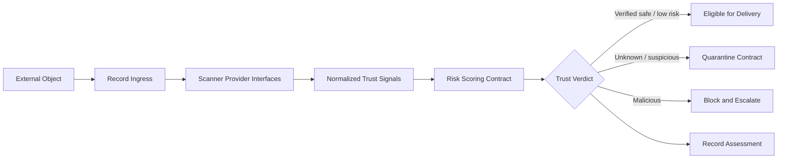

# Trust Gateway Design

## Purpose

The Trust Gateway is the standard ingress boundary for external digital objects. Gate
0 defines the pipeline but does not inspect files or activate Hope Shield.

## Contracts

- `TrustIngressObject`: metadata-only description of an ingress object.
- `TrustScannerProvider`: provider-neutral scanning interface.
- `TrustSignal`: normalized score, confidence, category, and reason.
- `TrustRiskScorer`: combines signals into a versioned assessment.
- `QuarantineContract`: isolate and explicitly release an object.
- `TrustAuditContract`: record ingress and assessment actions.
- `TrustGateway`: orchestrate inspection through the contracts.

## Deferred Work

Malware engines, file parsing, URL reputation, email authentication, sandboxing,
quarantine storage, policy thresholds, user warnings, and Hope Shield remain disabled
until their threat models and privacy requirements are approved.
